# 📈 Complete Property Transaction Flow - Implementation Plan

## The Complete Buyer Journey (Start to Finish)

```mermaid
graph TD
    A[Property Search] --> B[Property Selection]
    B --> C[Viewing Booking]
    C --> D[KYC/AML Verification]
    D --> E[Booking Deposit €5,000]
    E --> F[HTB Application]
    F --> G[Property Customization]
    G --> H[Contractual Deposit 10%]
    H --> I[Contract Signing]
    I --> J[Construction Updates]
    J --> K[Snagging Inspection]
    K --> L[Mortgage Drawdown]
    L --> M[Final Payment]
    M --> N[Property Handover]
    N --> O[Post-Sale Support]
```



## Detailed Implementation Requirements

### 🔴 1. KYC/AML Verification Flow
```typescript
// Required Implementation
interface KYCVerification {
  // Customer uploads documents
  uploadDocument(type: 'passport' | 'driving_license', file: File): Promise<void>;
  uploadProofOfAddress(file: File): Promise<void>;
  
  // Automated verification
  verifyIdentity(customerId: string): Promise<KYCResult>;
  
  // PEP/Sanctions screening  
  screenCustomer(customerId: string): Promise<ScreeningResult>;
  
  // Compliance dashboard
  getComplianceStatus(customerId: string): Promise<ComplianceStatus>;
}
```

### 🔴 2. Booking Deposit Flow
```typescript
// Required Implementation
interface BookingDepositFlow {
  // Payment processing
  createPaymentIntent(amount: number, propertyId: string): Promise<PaymentIntent>;
  processCardPayment(paymentMethod: PaymentMethod): Promise<PaymentResult>;
  
  // Deposit management
  holdDeposit(transactionId: string): Promise<void>;
  releaseDeposit(transactionId: string, reason: string): Promise<void>;
  refundDeposit(transactionId: string): Promise<RefundResult>;
  
  // Receipt generation
  generateReceipt(paymentId: string): Promise<Receipt>;
}
```

### 🔴 3. HTB Processing System
```typescript
// Required Implementation
interface HTBProcessing {
  // Application workflow
  submitHTBApplication(buyerId: string, data: HTBData): Promise<HTBApplication>;
  uploadHTBDocuments(applicationId: string, documents: Document[]): Promise<void>;
  
  // Revenue integration
  submitToRevenue(applicationId: string): Promise<RevenueResponse>;
  trackHTBStatus(applicationId: string): Promise<HTBStatus>;
  
  // Developer claim
  submitDeveloperClaim(applicationId: string): Promise<ClaimResult>;
  trackClaimPayment(claimId: string): Promise<PaymentStatus>;
}
```

### 🔴 4. Property Choice & Customization
```typescript
// Required Implementation  
interface PropertyChoiceFlow {
  // Selection process
  selectProperty(buyerId: string, unitId: string): Promise<Reservation>;
  
  // Customization
  selectFinishes(reservationId: string, choices: FinishChoice[]): Promise<void>;
  calculateCustomizationCost(choices: FinishChoice[]): Promise<CostBreakdown>;
  
  // Confirmation
  confirmPropertyChoice(reservationId: string): Promise<ConfirmationResult>;
  lockSpecification(reservationId: string): Promise<void>;
}
```

### 🔴 5. Contractual Deposit & Signing
```typescript
// Required Implementation
interface ContractFlow {
  // Deposit processing
  calculateContractualDeposit(purchasePrice: number): number;
  processContractualDeposit(transactionId: string): Promise<PaymentResult>;
  
  // Contract preparation
  generatePurchaseContract(transactionId: string): Promise<Contract>;
  sendForReview(contractId: string, recipients: string[]): Promise<void>;
  
  // Digital signing
  initiateDocuSign(contractId: string): Promise<DocuSignSession>;
  trackSigningStatus(sessionId: string): Promise<SigningStatus>;
  storeSignedContract(contractId: string, signedDoc: Document): Promise<void>;
}
```

### 🔴 6. Snagging Inspection System
```typescript
// Required Implementation
interface SnaggingSystem {
  // Inspection scheduling
  scheduleInspection(propertyId: string, buyerId: string): Promise<Appointment>;
  
  // Snag management
  createSnagList(propertyId: string): Promise<SnagList>;
  addSnagItem(snagListId: string, item: SnagItem): Promise<void>;
  uploadSnagPhoto(snagId: string, photo: File): Promise<void>;
  
  // Resolution tracking
  assignToContractor(snagId: string, contractorId: string): Promise<void>;
  updateSnagStatus(snagId: string, status: SnagStatus): Promise<void>;
  
  // Sign-off
  buyerSignOff(snagListId: string): Promise<void>;
  generateCertificate(snagListId: string): Promise<Certificate>;
}
```

### 🔴 7. Mortgage Drawdown
```typescript
// Required Implementation
interface MortgageDrawdown {
  // Lender integration
  connectToLender(lenderId: string, credentials: LenderAuth): Promise<void>;
  
  // Drawdown process
  requestDrawdown(mortgageId: string, amount: number): Promise<DrawdownRequest>;
  trackDrawdownStatus(requestId: string): Promise<DrawdownStatus>;
  
  // Funds management
  confirmFundsReceived(transactionId: string): Promise<void>;
  allocateFunds(transactionId: string): Promise<FundAllocation>;
}
```

### 🔴 8. Property Handover
```typescript
// Required Implementation
interface HandoverProcess {
  // Scheduling
  scheduleHandover(propertyId: string): Promise<HandoverAppointment>;
  
  // Pre-handover
  generateHandoverChecklist(propertyId: string): Promise<Checklist>;
  recordMeterReadings(propertyId: string, readings: MeterReading[]): Promise<void>;
  
  // Handover
  issueKeys(propertyId: string, sets: number): Promise<KeyIssuance>;
  deliverDocumentation(propertyId: string): Promise<DocumentPackage>;
  
  // Completion
  confirmHandover(propertyId: string, buyerId: string): Promise<HandoverCertificate>;
  triggerWelcomePack(propertyId: string): Promise<void>;
}
```

### 🔴 9. Post-Sale Management
```typescript
// Required Implementation
interface PostSaleManagement {
  // Warranty management
  registerWarranties(propertyId: string): Promise<Warranty[]>;
  submitWarrantyClaim(warrantyId: string, issue: Issue): Promise<Claim>;
  
  // Maintenance
  reportIssue(propertyId: string, issue: MaintenanceIssue): Promise<Ticket>;
  scheduleCallout(ticketId: string): Promise<Appointment>;
  
  // Community
  joinOwnersCommunity(propertyId: string): Promise<void>;
  accessHomeManual(propertyId: string): Promise<Manual>;
  
  // Annual inspections
  scheduleAnnualInspection(propertyId: string): Promise<Inspection>;
}
```

## Infrastructure Requirements

### Payment Gateway Integration
```typescript
// Stripe integration needed
const stripe = require('stripe')(process.env.STRIPE_SECRET_KEY);

// Payment processing
async function processPayment(amount: number, currency: string = 'EUR') {
  const paymentIntent = await stripe.paymentIntents.create({
    amount: amount * 100, // Convert to cents
    currency,
    metadata: {
      propertyId,
      buyerId,
      paymentType: 'booking_deposit'
    }
  });
  
  return paymentIntent;
}
```

### Document Management System
```typescript
// AWS S3 integration needed
const s3 = new AWS.S3();

async function uploadDocument(file: File, category: string) {
  const params = {
    Bucket: 'prop-ie-documents',
    Key: `${category}/${buyerId}/${file.name}`,
    Body: file,
    ContentType: file.type,
    ServerSideEncryption: 'AES256'
  };
  
  return s3.upload(params).promise();
}
```

### Notification System
```typescript
// Multi-channel notifications
interface NotificationService {
  sendEmail(to: string, template: string, data: any): Promise<void>;
  sendSMS(to: string, message: string): Promise<void>;
  sendPushNotification(userId: string, notification: Notification): Promise<void>;
  sendInAppNotification(userId: string, message: string): Promise<void>;
}
```

## Priority Implementation Order

### Phase 1: Core Transaction Flow (2 months)
1. Payment gateway integration
2. Document management system  
3. Basic notification system
4. Transaction state management

### Phase 2: Legal & Compliance (2 months)
1. KYC/AML integration
2. Digital contract signing
3. Compliance tracking
4. Audit logging

### Phase 3: Purchase Journey (2 months)
1. Booking deposit flow
2. HTB processing
3. Property customization
4. Contractual deposit

### Phase 4: Completion Flow (2 months)
1. Snagging system
2. Mortgage drawdown
3. Handover process
4. Post-sale support

## Estimated Timeline: 8 months
## Estimated Cost: €600,000-€800,000
## Required Team: 5-6 developers

The platform needs substantial development to handle complete property transactions from search to post-sale support.