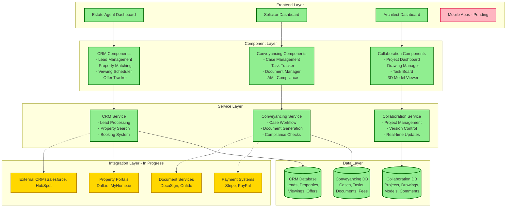
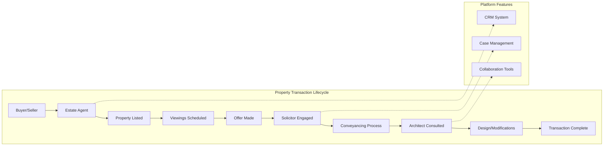

# Platform Architecture Diagram

## User Journey Flow

## Component Status Overview

| Component | Status | Location | Key Features |
|-----------|---------|-----------|--------------|
| **Estate Agent CRM** | ✅ Complete | `/agent/dashboard` | Lead management, Property matching, Viewing scheduler |
| **Solicitor System** | ✅ Complete | `/solicitor/dashboard` | Case tracking, Document management, AML compliance |
| **Architect Tools** | ✅ Complete | `/architect/collaboration` | Drawing management, 3D models, Task boards |
| **Third-party APIs** | 🏗️ In Progress | `/src/lib/integrations` | Property portals, Payment gateways, DocuSign |
| **Mobile Apps** | 📋 Pending | - | React Native apps for iOS/Android |
| **Multi-tenancy** | 📋 Pending | - | White-label support, Custom domains |

## Quick Test Links

When running the development server (`npm run dev`), you can access:

1. **Estate Agent CRM**: [http://localhost:3000/agent/dashboard](http://localhost:3000/agent/dashboard)
   - View leads and manage properties
   - Schedule viewings
   - Track offers

2. **Solicitor Conveyancing**: [http://localhost:3000/solicitor/dashboard](http://localhost:3000/solicitor/dashboard)
   - Click "View Conveyancing Dashboard" for full system
   - Manage cases and documents
   - Track compliance

3. **Architect Collaboration**: [http://localhost:3000/architect/dashboard](http://localhost:3000/architect/dashboard)
   - Click "Collaboration Hub" for tools
   - Manage drawings and 3D models
   - Coordinate with team

## Data Models Overview

### CRM Schema
- **Lead**: Potential buyers/sellers
- **Property**: Property listings
- **Viewing**: Scheduled property viewings
- **Offer**: Purchase offers
- **Client**: Registered clients

### Conveyancing Schema
- **ConveyancingCase**: Legal cases
- **ConveyancingTask**: Workflow tasks
- **Document**: Legal documents
- **AMLCheck**: Compliance checks
- **LegalFee**: Billing information

### Collaboration Schema
- **Project**: Architectural projects
- **Drawing**: Technical drawings
- **DrawingRevision**: Version control
- **BuildingModel**: 3D models
- **ProjectTask**: Project tasks

## Key Technologies Used

- **Frontend**: Next.js 15.3.1, React 18, TypeScript
- **UI Library**: Radix UI, Tailwind CSS
- **Database**: Prisma ORM (PostgreSQL)
- **3D Graphics**: Three.js
- **State Management**: React Context API
- **Real-time**: EventEmitter
- **Authentication**: NextAuth.js