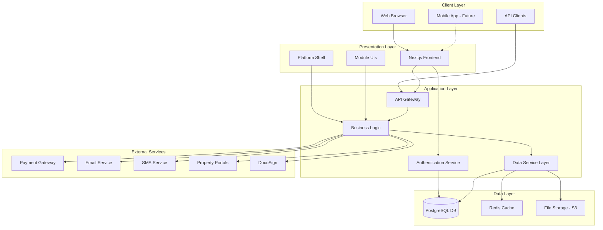
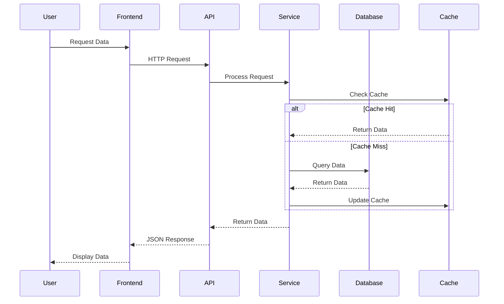
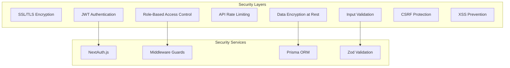
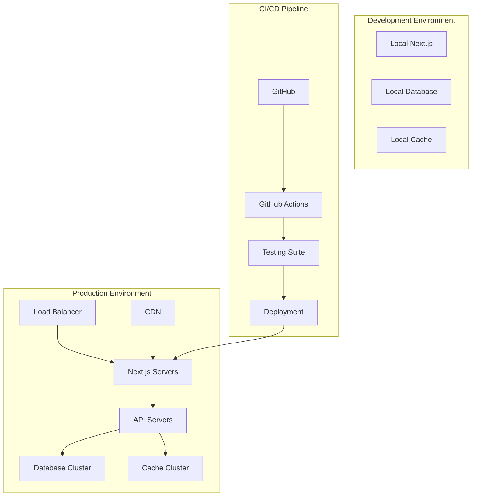

# PropPlatform System Architecture

## High-Level Architecture



## Component Architecture

```mermaid
graph LR
    subgraph "Frontend Components"
        F1[PlatformShell]
        F2[Estate Agency Module]
        F3[Legal Module]
        F4[Architecture Module]
        F5[Shared Components]
    end

    subgraph "API Routes"
        G1[/api/auth]
        G2[/api/properties]
        G3[/api/cases]
        G4[/api/projects]
        G5[/api/users]
    end

    subgraph "Services"
        H1[AuthService]
        H2[CRMService]
        H3[ConveyancingService]
        H4[CollaborationService]
        H5[DataService]
    end

    F1 --> G1
    F2 --> G2
    F3 --> G3
    F4 --> G4
    
    G1 --> H1
    G2 --> H2
    G3 --> H3
    G4 --> H4
    
    H1 --> H5
    H2 --> H5
    H3 --> H5
    H4 --> H5
```

## Data Flow Architecture



## Security Architecture



## Deployment Architecture



## Technology Stack

### Frontend
- **Framework**: Next.js 15.3.1
- **Language**: TypeScript
- **UI Library**: React 18
- **Styling**: Tailwind CSS
- **Components**: Radix UI
- **State Management**: React Context
- **Charts**: Recharts
- **Animations**: Framer Motion
- **Forms**: React Hook Form
- **Validation**: Zod

### Backend
- **Runtime**: Node.js
- **Framework**: Next.js API Routes
- **Language**: TypeScript
- **ORM**: Prisma
- **Database**: PostgreSQL
- **Cache**: Redis (planned)
- **Authentication**: NextAuth.js
- **File Storage**: AWS S3

### Infrastructure
- **Hosting**: Vercel / AWS
- **CDN**: CloudFront
- **Monitoring**: CloudWatch
- **CI/CD**: GitHub Actions
- **Container**: Docker
- **Orchestration**: Kubernetes (future)

### Development Tools
- **Version Control**: Git
- **Package Manager**: npm/pnpm
- **Testing**: Jest, React Testing Library
- **Linting**: ESLint
- **Formatting**: Prettier
- **API Testing**: Postman/Insomnia

## Database Schema Overview

```
Users & Auth
├── User
├── Session
├── Account
└── Role

Real Estate
├── Property
├── Development
├── Unit
└── Amenity

CRM
├── Lead
├── Contact
├── Client
└── Activity

Legal
├── Case
├── Document
├── Task
└── Compliance

Architecture
├── Project
├── Drawing
├── Model
└── Task

Transactions
├── Offer
├── Payment
├── Invoice
└── Commission
```

## API Design Principles

1. **RESTful Design**
   - Standard HTTP methods (GET, POST, PUT, DELETE)
   - Consistent URL patterns
   - JSON request/response format

2. **Authentication**
   - JWT tokens for API access
   - Session-based for web app
   - Role-based permissions

3. **Validation**
   - Zod schemas for input validation
   - Comprehensive error messages
   - Type-safe responses

4. **Performance**
   - Pagination for list endpoints
   - Field selection support
   - Response caching

5. **Security**
   - Input sanitization
   - SQL injection prevention
   - Rate limiting
   - CORS configuration

## Scalability Considerations

1. **Horizontal Scaling**
   - Stateless application servers
   - Database read replicas
   - Load balancing

2. **Caching Strategy**
   - Redis for session storage
   - CDN for static assets
   - API response caching

3. **Performance Optimization**
   - Code splitting
   - Lazy loading
   - Image optimization
   - Database indexing

4. **Monitoring**
   - Application metrics
   - Error tracking
   - Performance monitoring
   - Usage analytics

## Future Enhancements

1. **Mobile Applications**
   - React Native apps
   - Offline support
   - Push notifications

2. **Advanced Analytics**
   - Business intelligence
   - Predictive analytics
   - Custom dashboards

3. **AI/ML Integration**
   - Property valuation
   - Lead scoring
   - Document analysis

4. **Blockchain**
   - Smart contracts
   - Property tokenization
   - Transaction verification