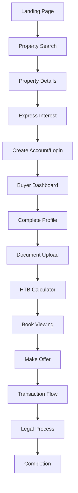
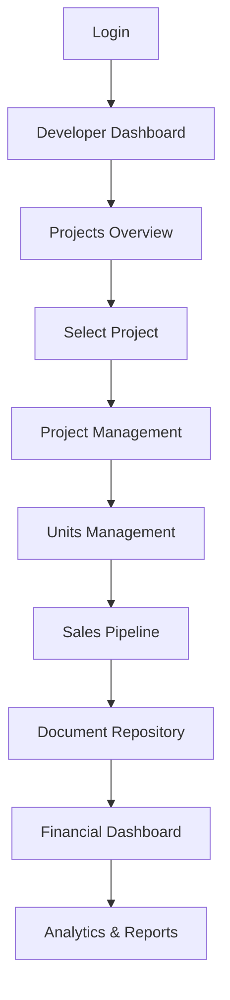
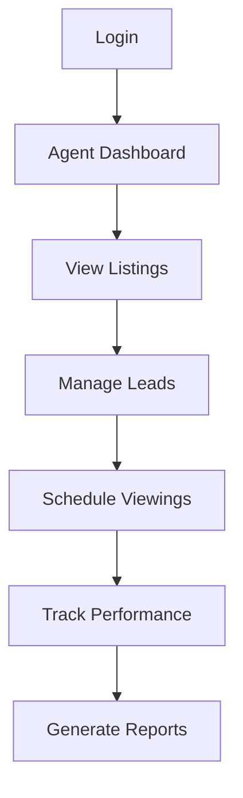
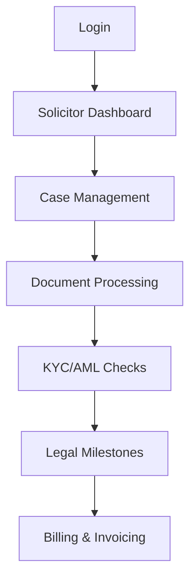

# User Flow Integration Guide

## Overview

This guide documents how all application components work together to create seamless user journeys for each role type.

## Navigation Architecture

### Primary Navigation Components

1. **MainNavigation.tsx** - The main navigation bar used across the application
2. **SmartNav.tsx** - Role-specific navigation with transaction context
3. **ProfessionalBanner.tsx** - Top banner for professional accounts
4. **NotificationCenter.tsx** - Real-time notifications component

### Role-Based Navigation Mapping

```typescript
// Navigation routes by user role
const roleNavigationMap = {
  BUYER: {
    dashboard: '/buyer',
    primaryNav: [
      { label: 'Property Search', href: '/properties' },
      { label: 'My Journey', href: '/buyer/journey' },
      { label: 'Documents', href: '/buyer/documents' },
      { label: 'Help to Buy', href: '/buyer/htb' }
    ],
    secondaryNav: [
      { label: 'Mortgage Calculator', href: '/resources/calculators/mortgage-calculator' },
      { label: 'First Time Buyer Guide', href: '/resources/property-guides/first-time-buyer-guide' }
    ]
  },
  DEVELOPER: {
    dashboard: '/developer',
    primaryNav: [
      { label: 'Projects', href: '/developer/projects' },
      { label: 'Transactions', href: '/developer/transactions' },
      { label: 'Documents', href: '/developer/documents' },
      { label: 'Finance', href: '/developer/finance' }
    ],
    secondaryNav: [
      { label: 'Analytics', href: '/developer/analytics' },
      { label: 'Sales Report', href: '/developer/reports' }
    ]
  },
  AGENT: {
    dashboard: '/agents',
    primaryNav: [
      { label: 'Listings', href: '/agents/listings' },
      { label: 'Leads', href: '/agents/leads' },
      { label: 'Viewings', href: '/agents/viewings' },
      { label: 'Performance', href: '/agents/performance' }
    ]
  },
  SOLICITOR: {
    dashboard: '/solicitor',
    primaryNav: [
      { label: 'Cases', href: '/solicitor/cases' },
      { label: 'Documents', href: '/solicitor/documents' },
      { label: 'Compliance', href: '/solicitor/compliance' },
      { label: 'Billing', href: '/solicitor/billing' }
    ]
  },
  INVESTOR: {
    dashboard: '/investor',
    primaryNav: [
      { label: 'Portfolio', href: '/investor/portfolio' },
      { label: 'Market', href: '/investor/market' },
      { label: 'Opportunities', href: '/investor/opportunities' },
      { label: 'Financial', href: '/investor/financial' }
    ]
  }
};
```

## User Journey Flows

### 1. Buyer Journey



**Key Integration Points:**
- Authentication gate at Express Interest
- Progressive disclosure of features
- Context-aware navigation showing current stage
- Transaction-specific navigation when deal is active

### 2. Developer Journey



**Key Integration Points:**
- Project context maintained across navigation
- Quick actions based on project stage
- Real-time transaction updates
- Document version control integration

### 3. Agent Journey



### 4. Solicitor Journey



## Implementation Details

### Context Providers

```typescript
// App-wide context providers in layout.tsx
<AuthProvider>
  <UserRoleProvider>
    <TransactionProvider>
      <NotificationProvider>
        <NavigationProvider>
          {children}
        </NavigationProvider>
      </NotificationProvider>
    </TransactionProvider>
  </UserRoleProvider>
</AuthProvider>
```

### Navigation State Management

```typescript
// Navigation context for advanced features
interface NavigationContextState {
  currentPath: string;
  breadcrumbs: BreadcrumbItem[];
  userFlow: UserFlowType;
  activeTransaction: Transaction | null;
  navigationHistory: string[];
  quickActions: QuickAction[];
}
```

### Protected Routes

```typescript
// Role-based route protection
<ProtectedRoute 
  requiredRole={['DEVELOPER']} 
  requiredPermission={['project.manage']}
  enforceMFA={true}
>
  <ProjectManagement />
</ProtectedRoute>
```

## Navigation Features

### 1. Contextual Navigation

- Navigation adapts based on:
  - User role
  - Current transaction state
  - Active project/property
  - Completion status of tasks

### 2. Quick Actions

Role-specific quick actions appear in navigation:
- **Buyer**: Mortgage Calculator, Document Upload
- **Developer**: Create Project, View Analytics
- **Agent**: Add Listing, Schedule Viewing
- **Solicitor**: New Case, Compliance Check

### 3. Transaction Badge

Shows count of active transactions relevant to user:
```typescript
const getTransactionCount = () => {
  return transactions.filter(t => {
    switch(user.role) {
      case 'BUYER': return t.buyerId === user.id && t.status !== 'COMPLETED';
      case 'DEVELOPER': return t.developerId === user.id && t.status !== 'COMPLETED';
      // ... other roles
    }
  }).length;
};
```

### 4. Breadcrumb Navigation

Automatic breadcrumb generation for deep navigation:
```typescript
const breadcrumbs = [
  { label: 'Dashboard', href: '/developer' },
  { label: 'Projects', href: '/developer/projects' },
  { label: projectName, href: `/developer/projects/${projectId}` },
  { label: 'Units', href: `/developer/projects/${projectId}/units` }
];
```

## State Synchronization

### 1. Auth State

```typescript
// Auth state synchronization across components
const { user, isAuthenticated, signOut } = useAuth();

// Navigation updates based on auth state
useEffect(() => {
  if (!isAuthenticated) {
    router.push('/login');
  }
}, [isAuthenticated]);
```

### 2. Transaction State

```typescript
// Transaction context for navigation badges
const { transactions, activeTransaction } = useTransaction();

// Show transaction-specific navigation
{activeTransaction && (
  <TransactionNav transaction={activeTransaction} />
)}
```

### 3. Notification State

```typescript
// Real-time notification updates
const { notifications, unreadCount } = useNotifications();

// Update navigation badge
<NotificationBadge count={unreadCount} />
```

## Progressive Disclosure

Navigation reveals features progressively:

1. **Unauthenticated**: Basic navigation only
2. **Authenticated**: Role-specific primary actions
3. **Active Transaction**: Transaction management tools
4. **Completed Tasks**: Advanced features unlock

## Mobile Navigation

### Responsive Design

- Hamburger menu for mobile
- Touch-optimized dropdowns
- Swipe gestures for navigation
- Bottom navigation for key actions

### Mobile-Specific Features

```typescript
// Mobile navigation with gestures
<MobileNav
  onSwipeLeft={() => navigateNext()}
  onSwipeRight={() => navigateBack()}
  showBottomNav={true}
/>
```

## Performance Optimization

### 1. Lazy Loading

```typescript
// Lazy load navigation components
const DeveloperNav = lazy(() => import('./navigation/DeveloperNav'));
const BuyerNav = lazy(() => import('./navigation/BuyerNav'));
```

### 2. Memoization

```typescript
// Memoize navigation items
const navigationItems = useMemo(() => 
  generateNavItems(user.role), 
  [user.role]
);
```

### 3. Prefetching

```typescript
// Prefetch common navigation targets
useEffect(() => {
  prefetchRoute('/dashboard');
  prefetchRoute('/transactions');
}, []);
```

## Testing Navigation Flows

### E2E Tests

```typescript
describe('Buyer Navigation Flow', () => {
  it('should navigate through property purchase journey', async () => {
    await login('buyer@test.com');
    await navigateTo('/properties');
    await selectProperty('unit-123');
    await expressInterest();
    await completeProfile();
    await uploadDocuments();
    expect(currentPath()).toBe('/buyer/journey/legal-process');
  });
});
```

### Unit Tests

```typescript
describe('Navigation Component', () => {
  it('should show role-specific navigation items', () => {
    const { getByText } = render(
      <MainNavigation />, 
      { wrapper: AuthProvider, initialState: { user: { role: 'BUYER' } } }
    );
    expect(getByText('Property Search')).toBeInTheDocument();
    expect(getByText('My Journey')).toBeInTheDocument();
  });
});
```

## Common Integration Patterns

### 1. Navigation with Modals

```typescript
// Open modal without losing navigation context
const openPropertyModal = (propertyId) => {
  pushState({ modalOpen: true, propertyId });
  showModal(<PropertyDetails id={propertyId} />);
};
```

### 2. Deep Linking

```typescript
// Support deep links with context
const handleDeepLink = (url) => {
  const { role, resource, id } = parseDeepLink(url);
  if (hasPermission(role, resource)) {
    navigateTo(`/${role}/${resource}/${id}`);
  }
};
```

### 3. Navigation Guards

```typescript
// Prevent navigation based on state
const canNavigateAway = () => {
  if (hasUnsavedChanges) {
    return confirm('You have unsaved changes. Leave anyway?');
  }
  return true;
};
```

## Troubleshooting

### Common Issues

1. **Navigation not updating**: Check context provider hierarchy
2. **Role mismatch**: Verify auth state synchronization
3. **Missing links**: Ensure role permissions are set correctly
4. **Performance issues**: Check for unnecessary re-renders

### Debug Tools

```typescript
// Navigation debug component
<NavigationDebugger 
  showCurrentPath={true}
  showBreadcrumbs={true}
  showUserRole={true}
  showPermissions={true}
/>
```

## Best Practices

1. **Consistent Navigation**: Keep navigation patterns consistent across roles
2. **Clear Hierarchy**: Use visual hierarchy to show navigation levels
3. **Accessible**: Ensure all navigation is keyboard accessible
4. **Performance**: Lazy load heavy navigation components
5. **Testing**: Test all navigation paths for each role
6. **Documentation**: Document role-specific navigation patterns

## Future Enhancements

1. AI-powered navigation suggestions
2. Personalized quick actions
3. Voice navigation support
4. Gesture-based navigation
5. Context-aware shortcuts