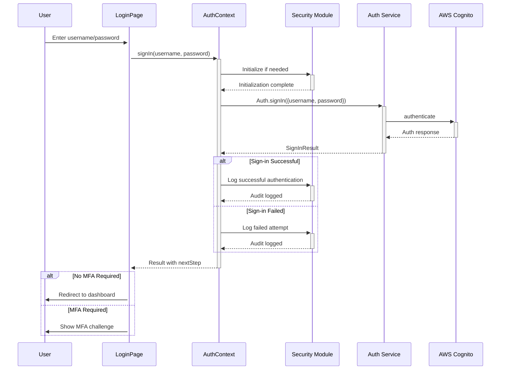
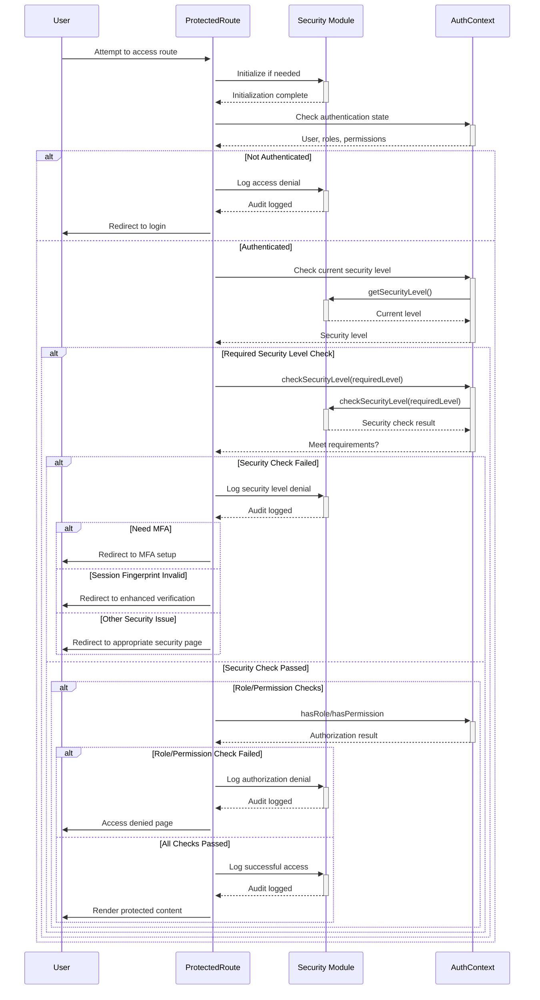

# Authentication Flow Documentation

## Overview

This document outlines the authentication and authorization flow in the PropIE AWS application, integrating AWS Amplify v6 with our enhanced security module. The implementation provides a seamless authentication experience with robust security features including role-based access control, permission-based access, MFA (Multi-Factor Authentication), and security level enforcement.

## Architecture

The authentication system is built on three main components:

1. **AWS Amplify v6**: Provides the core authentication services through Amazon Cognito
2. **Security Module**: Adds enhanced security features including MFA, threat detection, and audit logging
3. **Authentication Context**: Centralizes the auth state and provides a consistent API for all components


## Authentication Flow

### 1. Initial Authentication

The login process begins with basic username/password authentication, with security module initialization:



### 2. MFA Challenge Flow

If MFA is required, the user is presented with a challenge. This process also updates the security level:

```mermaid
sequenceDiagram
    User->>+MFAChallenge: Enter verification code
    MFAChallenge->>+AuthContext: confirmSignIn(code)
    AuthContext->>+Auth Service: Auth.confirmSignIn(code)
    Auth Service->>+AWS Cognito: confirmSignIn(code)
    AWS Cognito-->>-Auth Service: Confirmation result
    Auth Service-->>-AuthContext: Result
    
    alt MFA Successful
        AuthContext->>+Security Module: Log successful MFA verification
        Security Module-->>-AuthContext: Audit logged
        AuthContext->>+Security Module: Elevate security level
        Security Module-->>-AuthContext: Security level updated
        AuthContext-->>-MFAChallenge: Success
        MFAChallenge-->>-User: Redirect to appropriate page
    else MFA Failed
        AuthContext->>+Security Module: Log failed MFA attempt
        Security Module-->>-AuthContext: Audit logged
        AuthContext-->>-MFAChallenge: Failure
        MFAChallenge-->>-User: Show error message
    end
```

### 3. Protected Route Authorization

Access to protected routes is managed by the enhanced ProtectedRoute component with detailed security checks:



## Core Components

### 1. AuthContext

The central authentication state manager that:

- Maintains user authentication state
- Provides authentication methods (signIn, signOut, etc.)
- Tracks MFA status and security level
- Handles user roles and permissions

### 2. Security Module

Enhances the basic authentication with:

- Advanced MFA capabilities (TOTP, SMS, recovery codes)
- Security level enforcement
- Threat detection
- Session fingerprinting
- Audit logging

### 3. ProtectedRoute Component

Controls access to routes based on:

- Authentication status
- Role requirements
- Permission requirements
- MFA enforcement
- Security level requirements

## Authentication Status and Security Levels

The system defines three security levels:

1. **Basic**: User is authenticated with username/password
2. **Medium**: User has valid session fingerprint and no detected threats
3. **High**: User has MFA enabled and meets all medium security requirements

## Role-Based Access Control

Access is controlled through a combination of:

1. **Roles**: Primary access control mechanism (e.g., ADMIN, DEVELOPER, BUYER, INVESTOR)
2. **Permissions**: Fine-grained access control using a permission string format (e.g., "read:properties")
3. **Security Requirements**: Additional requirements like MFA for sensitive operations

## MFA Implementation

The system supports multiple MFA methods:

1. **TOTP**: Time-based One-Time Password using authenticator apps
2. **SMS**: Text message verification codes
3. **Recovery Codes**: For backup access when other methods are unavailable

## Testing Authentication Flow

A test route at `/protected-test` demonstrates different protection levels:

- Basic authentication protection
- Role-based protection
- Permission-based protection
- MFA-required protection
- Security level enforcement

## Security Best Practices

The implementation follows security best practices:

1. **Principle of Least Privilege**: Users only have access to what they need
2. **Defense in Depth**: Multiple layers of security (auth, roles, MFA, etc.)
3. **Fail Secure**: Any security check failure defaults to denying access
4. **Audit Logging**: All security events are logged for monitoring and analysis
5. **Session Management**: Sessions are tracked and can be revoked
6. **Error Handling**: Security-related errors provide minimal information to users

## User Experience Considerations

The authentication flow is designed with these UX principles:

1. **Progressive Security**: Basic features work with minimal security, sensitive actions require higher security
2. **Clear Feedback**: Users understand why they need to complete security steps
3. **Multiple Options**: Support for different MFA methods to accommodate user preferences
4. **Graceful Degradation**: Core functionality remains accessible even if advanced security features fail

## Usage Examples

### Basic Route Protection

```tsx
// Basic protection (authentication only)
<ProtectedRoute>
  <SensitiveComponent />
</ProtectedRoute>
```

### Role-Based Protection

```tsx
// Only allow admin users
<ProtectedRoute requiredRole="ADMIN">
  <AdminPanel />
</ProtectedRoute>

// Allow multiple roles
<ProtectedRoute requiredRole={["ADMIN", "DEVELOPER"]}>
  <ManagementPanel />
</ProtectedRoute>
```

### Permission-Based Protection

```tsx
// Require specific permission
<ProtectedRoute requiredPermission="delete:users">
  <UserDeleteButton />
</ProtectedRoute>
```

### MFA Enforcement

```tsx
// Require MFA to be enabled
<ProtectedRoute enforceMFA={true}>
  <SensitiveDataDisplay />
</ProtectedRoute>
```

### Security Level Enforcement

```tsx
// Require high security level
<ProtectedRoute securityLevel="high">
  <FinancialTransactions />
</ProtectedRoute>
```

### Using the useSecureAuth Hook

For advanced integration of authentication and security in components that need more control, use the `useSecureAuth` hook:

```tsx
import { useSecureAuth } from '@/hooks/useSecureAuth';

function FinancialOperation() {
  const { 
    user, 
    isAuthenticated, 
    securityLevel,
    requiresAuth, 
    elevateSecurityLevel,
    security
  } = useSecureAuth();
  
  const handleSensitiveOperation = async () => {
    // Check if user meets all security requirements
    const canProceed = await requiresAuth({
      role: 'INVESTOR',
      permission: 'write:portfolio',
      securityLevel: 'high',
      requiresMFA: true
    });
    
    if (!canProceed) {
      // If not at required security level, try to elevate
      const elevated = await elevateSecurityLevel('high');
      if (!elevated) {
        // Show MFA setup or security upgrade UI
        return;
      }
    }
    
    // Proceed with operation
    // ...
  };
  
  return (
    <div>
      {isAuthenticated ? (
        <button onClick={handleSensitiveOperation}>
          Perform Financial Operation
        </button>
      ) : (
        <p>Please log in to continue</p>
      )}
    </div>
  );
}
```

## Code Organization

```
src/
├── context/
│   └── AuthContext.tsx          # Central auth state management
├── hooks/
│   └── useSecureAuth.ts         # Integrated auth and security hook
├── lib/
│   ├── amplify/
│   │   ├── auth.ts              # AWS Amplify auth wrapper
│   │   └── index.ts             # Amplify initialization
│   └── security/
│       ├── index.ts             # Security module main export
│       ├── mfa/                 # MFA implementation
│       │   └── index.ts         # Consolidated MFA service
│       ├── auditLogger.ts       # Security audit logging
│       ├── sessionFingerprint.ts# Session validation
│       ├── threatDetection.ts   # Threat detection system
│       └── cachedSecurityApi.ts # Performance optimized security
├── components/
│   ├── auth/
│   │   ├── LoginForm.tsx        # Login form
│   │   └── ProtectedRoute.tsx   # Enhanced route protection
│   └── security/
│       ├── MFAChallenge.tsx     # MFA verification UI
│       └── SecuritySetupWizard.tsx # Security setup interface
├── tests/
│   └── security/
│       └── authFlow.test.ts     # Authentication flow tests
└── app/
    ├── login/
    │   └── page.tsx             # Login page with MFA flow
    └── security/
        └── mfa-setup/           # MFA setup flow
```

## Troubleshooting

Common issues and solutions:

1. **Unable to log in**: Verify Cognito user pool configuration and check browser console for errors
2. **MFA not working**: Ensure time sync for TOTP and check phone number format for SMS
3. **Protected route incorrectly redirecting**: Check role/permission configuration and security level requirements
4. **Security module errors**: Ensure the Security module is properly initialized before use

## Maintenance and Future Enhancements

Areas for future enhancement:

1. **OAuth Integration**: Add social login providers (Google, Facebook, etc.)
2. **Risk-Based Authentication**: Adjust security requirements based on risk factors
3. **Biometric Authentication**: Add support for WebAuthn/FIDO2 for passwordless auth
4. **Advanced Threat Detection**: Enhance the threat detection capabilities
5. **Self-Service Account Recovery**: Improve account recovery flows